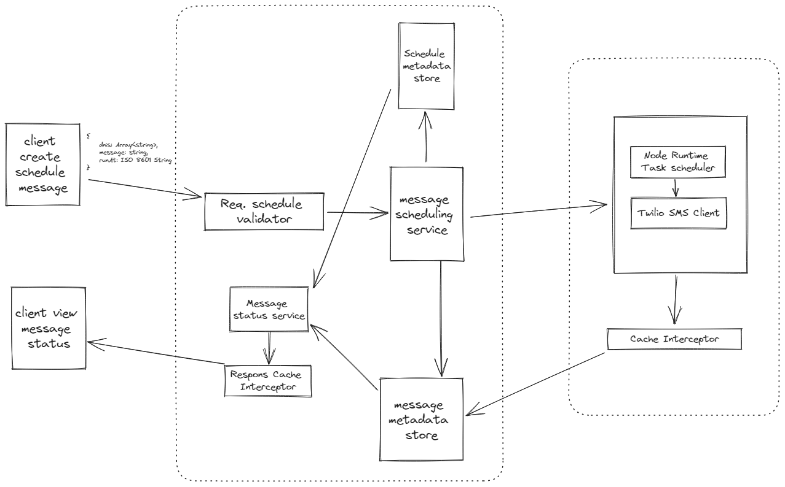
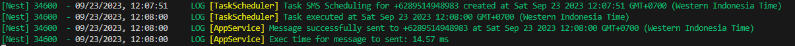

# Forest Interactive - SMS Scheduling System

## Table of Contents

- [Forest Interactive - SMS Scheduling System](#forest-interactive---sms-scheduling-system)
  - [Table of Contents](#table-of-contents)
  - [Introduction](#introduction)
  - [Database Schema](#database-schema)
  - [Backend Components](#backend-components)
    - [NestJS Application](#nestjs-application)
    - [MySQL Database](#mysql-database)
    - [Scheduling Operation](#scheduling-operation)
    - [SMS Integration with Twilio](#sms-integration-with-twilio)
    - [Cache Management](#cache-management)
  - [API Endpoints :](#api-endpoints-)
  - [Installation](#installation)
      - [Clone the application](#clone-the-application)
      - [Install Required Dependencies](#install-required-dependencies)
      - [Setting up the environment variable](#setting-up-the-environment-variable)
      - [Running up the application ✌️](#running-up-the-application-️)
      - [Run the application using Docker](#run-the-application-using-docker)
        - [This method assumes you have Docker installed in your operating system.](#this-method-assumes-you-have-docker-installed-in-your-operating-system)
  - [API Performance Test Result](#api-performance-test-result)
  - [Test Result](#test-result)
  - [Criticism and Suggestions](#criticism-and-suggestions)

## Introduction

This SMS Scheduling System is a flexible and scalable solution designed to send SMS messages to a list of recipients based on predefined schedules. This system ensures accurate and timely communication with recipients while optimizing performance and server load using caching techniques and compressing the response so it can be much lighter for the server to load the requests from clients.


## Database Schema

The system's database schema includes two main tables: `Schedules` and `Messages`.

- **Schedules Table:**
  - `id` (UUID): Unique identifier for each schedule.
  - `runAt` (DateTime): The time at which the schedule is set to run
  - `message` (String): The body message to be sent for each schedule.
- **Messages Table:**
  - `id` (UUID): Unique identifier for each message recipient
  - `phoneNumber` (string): The recipient's phone number.
  - `status` (enum: `DELVRD`, `ACCPTD`, `UNDELIV`, `UNKNOWN`): The status of the SMS message
  - `deliveryTime` (DateTime): Actual time to deliver the message

## Backend Components

### NestJS Application

I'm using ExpressJS over NestJS to serve the core of the SMS Scheduling System because NestJS give me various advantage in leveraging some technical implementation such as Scaling, Maintainability, Performance, and Logging System.

### MySQL Database

It was hard for me to choose which database to use for this use case. But, In the end, I chose MySQL over MongoDB because in this case, I thought that we could maximize the performance provided by MySQL in query transactions which could reduce the application load when running several queries concurrently on a predetermined schedule.

### Scheduling Operation

For this application, I developed the task scheduling operation by leveraging the `NodeJS.Timeout` module to minimize the build size of the app, this operation can save the task and execute the task within a certain time and not block any other task, but the drawback of using this operation may lead to a performance issue because of the `NodeJS.Timeout` only has the type Array of Number, which if we save so many schedules to run at the same time will consume the memory out.

### SMS Integration with Twilio

The system integrates with Twilio and can provide an SMPP protocol to send SMS messages to recipients. Twilio also has a built-in SDK in Typescript and NodeJS that I can leverage to help me finish this application.

### Cache Management

I'm using the NestJS `cache-manager` package to optimize the API and system performance within this application using mem-caching to save the cache in the RAM.

## API Endpoints :

- `POST /api/`: Create a new SMS scheduling task for a certain time.
- `GET /api/{messageId}`: Retrieve the status of a specific SMS message.
- `GET /api/schedule/{id}/sms`: Get a list of SMS messages sent for a given schedule.
- `GET /api/schedule/all`: Get a list of schedules with their associated messages, filtered by the status and date range.

## Installation

#### Clone the application

To run and install this application you can simply clone this repository by running the following commands in the CLI :

```bash
$ git clone https://github.com/disinibale/
```

#### Install Required Dependencies

Then after cloning the repository, you should install the required package by running this command :

```
$ npm install -g pnpm
$ pnpm install
```

#### Setting up the environment variable

After the package is successfully installed, you should create a `.env` file by copying this example and configuring every variable within this file to match your system configuration :

```
APP_PORT=5500

DB_NAME=your_db_name
DB_USER=your_db_user
DB_PASS=your_db_pass
DB_HOST=your_db_host
DB_PORT=your_db_port

TWILIO_SID=your_twilio_sid
TWILIO_AUTH_TOKEN=your_auth_token
TWILIO_PHONE_NUMBER=your_phone_number
```

To get the fill the `TWILIO_SID`, `TWILIO_AUTH_TOKEN` and `TWILIO_PHONE_NUMBER`. You have to register a free Twilio account and get those values from the following URL `https://console.twilio.com/` dashboard.

#### Running up the application ✌️

After all the configuration is completed, you can run the application simply by running this command on your CLI:

```
$ pnpm run start:dev
```

#### Run the application using Docker

##### This method assumes you have Docker installed in your operating system.

To run the application using docker, you have to customize the docker-compose.yaml first and change the environment variable on the `environment` object to use your environment application system. then you can run the following commands in your CLI :

```
$ docker compose up --build
```

## API Performance Test Result

The test carried out is an API test using the Postman tool, taking into account the speed of the response sent from the application. The results of the test that I got were using a local environment where the results obtained may very well be different from the server environment, depending on several factors such as RAM, CPU, and database connection pool.

## Test Result



As you can see, using this system that leverages ExpressJs that run on top of NestJS to send a message to the recipient only took about 14.57 ms. It is an astounding result that NodeJs can run the request to Twilio in that time, but I cannot provide how much time it takes for Twilio to send the SMS to the recipient since Twilio has its own system architecture. But I also can provide the screenshot of the SMS that has been received from my phone that looks like this :


## Criticism and Suggestions

This SMS Scheduling System that I have developed certainly cannot be said to be a perfect system, therefore there may be several considerations that can be improved in this system which I can mention in the following list.

- Change the scheduling operation using tools like `CRON` to avoid performance issues so the task will be executed at the OS level, and would avoid the Node V8 Engine Stack being overloaded with upcoming tasks.
- Change the caching technique from memcache to Redis if the application gets bigger. So, the data will not populated in the RAM but in the L2 Cache on the CPU to avoid consuming so much bigger memory.
- Add thread worker from the Node V8 engine to the system so we can maximize the server task more efficiently minimizing the use of load balancer to the server.
